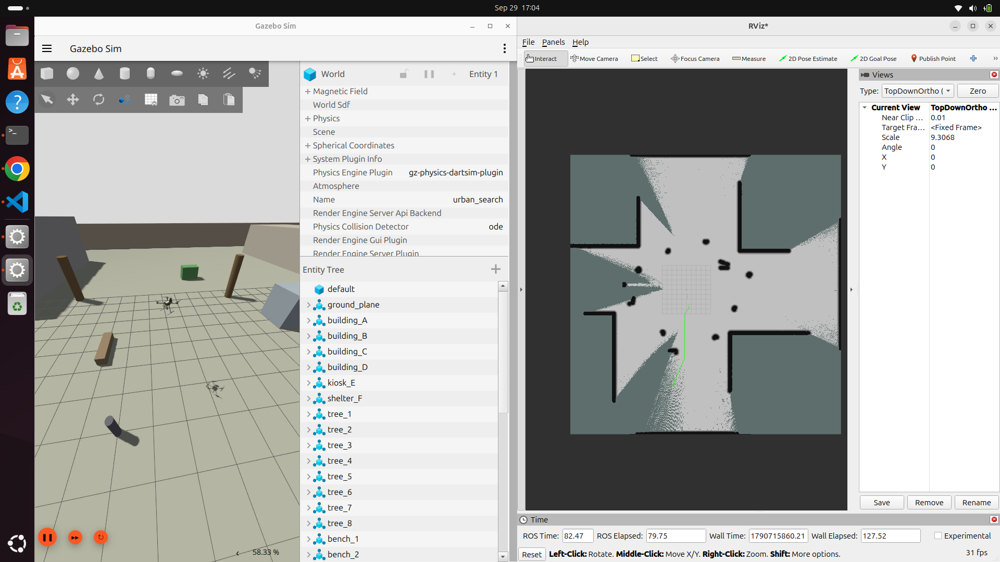

# Autonomous UAV Search Simulator

This project is a fully simulated autonomous UAV search system built with ROS 2, PX4, Gazebo, Nav2, SLAM, and YOLO.

The UAV launches in a custom urban environment, builds a map using lidar, autonomously explores unknown areas, avoids obstacles, and searches for a person using its onboard camera. When a person is detected with high confidence, the mission stops and reports the UAV's position.

The project demonstrate autonomous navigation, mapping, computer vision, ROS 2 integration, and PX4 flight control in a realistic simulation environment.

## Demo



## Prerequisites

This project is developed and tested on:
- Ubuntu 24.04 LTS
- ROS 2 Jazzy
- Gazebo Harmonic
- Python3
- Git
- CMake

## Installation

### Developer Tools

```bash
sudo apt update
sudo apt install build-essential cmake python3 python3-pip git python3.12-venv python3-colcon-common-extensions python3-rosdep
```
Initialize rosdep:
```bash
sudo rosdep init
rosdep update
```

### Clone this project

```bash
cd ~
git clone https://github.com/Dark2Darkk/Autonomous-UAV-Search-Simulator.git
cd Autonomous-UAV-Search-Simulator
```


### ROS 2 Jazzy
Follow the official ROS 2 Jazzy installation instructions.

Reference: https://docs.ros.org/en/jazzy/Installation/Ubuntu-Install-Debs.html

The ROS 2 workspace used in this project is:

 ~/Autonomous-UAV-Search-Simulator/ros2_ws

After installing, source ROS 2:

```bash
echo 'source /opt/ros/jazzy/setup.bash' >> ~/.bashrc
source ~/.bashrc
```


### Gazebo Harmonic

```bash
sudo apt update
sudo apt install ros-jazzy-ros-gz
```

Verify Gazebo:

```bash
gz sim
```

### PX4 X500 quadrotor

```bash
cd ~
git clone https://github.com/PX4/PX4-Autopilot.git --recursive
cd PX4-Autopilot
bash ./Tools/setup/ubuntu.sh --no-sim-tools
```

Restart the computer after installation, then verify PX4 builds.

```bash
cd ~/PX4-Autopilot
make px4_sitl
```

Verify:
```bash
make px4_sitl gz_x500
```
Allow PX4 SITL to operate without requiring an active QGroundControl/GCS datalink:
```bash
# Run these at the PX4 `pxh>` prompt, not in a Linux shell.
param set NAV_DLL_ACT 0
param save
```

### Install Custom Gazebo World and UAV Model

This project includes a custom Gazebo world and a custom X500 model containing both lidar and camera sensors.

Copy the custom assets into the PX4 Gazebo directories:

```bash
cp \
~/Autonomous-UAV-Search-Simulator/px4_assets/worlds/urban_search.sdf \
~/PX4-Autopilot/Tools/simulation/gz/worlds/

cp -r \
~/Autonomous-UAV-Search-Simulator/px4_assets/models/x500_lidar_cam \
~/PX4-Autopilot/Tools/simulation/gz/models/
```

### QGroundControl

You may want QGC to manually interface with PX4:

https://docs.qgroundcontrol.com/master/en/qgc-user-guide/getting_started/download_and_install.html

dependencies:
```bash
sudo apt install -y libfuse2 libxcb-xinerama0 libxkbcommon-x11-0 libxcb-cursor0
```

Make download executable and run it:
```bash
cd ~/Downloads
chmod +x QGroundControl-x86_64.AppImage
./QGroundControl-x86_64.AppImage
```

### GStreamer for Camera Support

```bash
sudo apt install \
gstreamer1.0-plugins-base \
gstreamer1.0-plugins-good \
gstreamer1.0-plugins-bad \
gstreamer1.0-plugins-ugly \
gstreamer1.0-libav \
libgstreamer-plugins-base1.0-dev
```
### Ultralytics

ROS -> OpenCV bridge:
```bash
sudo apt install ros-jazzy-cv-bridge python3-opencv
```

Virtual environment for ultralytics
```bash
cd ~/Autonomous-UAV-Search-Simulator/ros2_ws

python3 -m venv --system-site-packages .venv

source .venv/bin/activate

python -m pip install --upgrade pip
python -m pip install "numpy==1.26.4" "setuptools<80" "opencv-python<4.12"
python -m pip install ultralytics
python -m pip check
```

### ROS to PX4 connector

```bash
cd ~/Autonomous-UAV-Search-Simulator/ros2_ws/src

git clone https://github.com/PX4/px4_msgs.git
```


### Micro XRCE-DDS Agent

```bash
cd ~

git clone -b v2.4.3 \
    https://github.com/eProsima/Micro-XRCE-DDS-Agent.git

cd ~/Micro-XRCE-DDS-Agent

mkdir -p build
cd build

cmake ..
make -j$(nproc)

sudo make install
sudo ldconfig
```

### Explore lite

This project uses `explore_lite` for frontier-based autonomous exploration.

```bash
cd ~/Autonomous-UAV-Search-Simulator/ros2_ws/src

git clone https://github.com/robo-friends/m-explore-ros2.git
```

### Slam, RViz, and Nav2

```bash
sudo apt update

sudo apt install -y \
    ros-jazzy-slam-toolbox \
    ros-jazzy-rviz2 \
    ros-jazzy-navigation2 \
    ros-jazzy-nav2-bringup
```

ROS dependencies:
```bash
cd ~/Autonomous-UAV-Search-Simulator/ros2_ws

source /opt/ros/jazzy/setup.bash
source .venv/bin/activate

rosdep install \
    --from-paths src \
    --ignore-src \
    -r \
    -y
```

### Build the workspace

```bash
cd ~/Autonomous-UAV-Search-Simulator/ros2_ws

source /opt/ros/jazzy/setup.bash
source .venv/bin/activate

colcon build --symlink-install

source install/setup.bash
```

### Running the project

Terminal 1 kickoff PX4 and Gazebo:
```bash
cd ~/PX4-Autopilot

PX4_SYS_AUTOSTART=4013 \
PX4_GZ_WORLD=urban_search \
PX4_SIM_MODEL=gz_x500_lidar_cam \
./build/px4_sitl_default/bin/px4
```

Terminal 2 kickoff ROS 2 bridges, RViz, NAV 2, and SLAM:
```bash
cd ~/Autonomous-UAV-Search-Simulator/ros2_ws

source /opt/ros/jazzy/setup.bash
source .venv/bin/activate
source install/setup.bash

ros2 launch uav_vision sim_stack.launch.py
```

Terminal 3 kickoff autonomous flight, exploration, person detection, and mission logic:
```bash
cd ~/Autonomous-UAV-Search-Simulator/ros2_ws

source /opt/ros/jazzy/setup.bash
source .venv/bin/activate
source install/setup.bash

ros2 launch uav_vision mission_start.launch.py
```
